# Estado atual do trabalho
[Link para o PDF do artigo](readmeContent/ICCSA_2020.pdf)

[Link para o notebook do colab](readmeContent/colabNotebook.ipynb)

## Tarefas:
- Fazer simulação de espiral
- Rodar testes e gravar o desempenho de varias combinações de tamanho de bloco 8x8 16x16 32x32 8x16 4x4 4x8 4x16 16x64 8x128
- Plotar gráfico da memória para várias combinações de tamanho de bloco
- Implementar versão Karma em CPU(openMP)

## [25/02] ~ [17:23] -- [20:28]
- Adicionei os dois gráficos no paper usando o tikz
- Releitura do artigo
- Escrevi algumas linhas e tentei corrigir alguns detalhes 

## [24/02] ~ [13:30] -- [20:28]
- Ao chegar na minha sala, o computador estava inesperadamente ligado mas não respondia, constatei que o problema estava na memória RAM, e uma limpeza com uma borracha resolveu o problema.
- Adicionei um teste de 768x768 19000 instantes variando o blockingTimeSteps

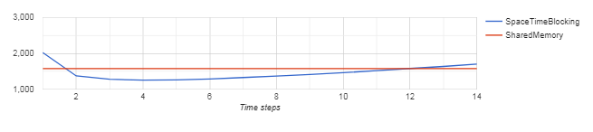

- Plotar os gráficos utilizando o tikz
- Sinto que hoje o trabalho não rendeu muito, teve um movimento maior na minha sala e acho que tirou um pouco minha atenção.

## [23/02] ~ [12:00] -- [22:00]
- Terminei os preparativos para fazer os testes de tempo
- Organizei o notebook e os códigos para rodar em diferentes tamanhos de domínio
- Realizei um teste travando o tamanho em 96x96 e a quantidade de instantes de tempo em 12000 e variando a quantidade de instantes de tempo por chamada de kernel e plotei o resultado no grafico:

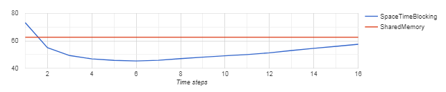

- Para conferir os resultados gerei os gifs para varios tamanhos diferentes de domínio com  quantidade de instantes de tempo por chamada de kernel igual a 15 e  quantidade de instantes de tempo igual 19000 e atualizei as vizualizações com elas, até este commit as vizualizações eram por  quantidade de instantes de tempo por chamada de kernel.
- Atualização nos códigos para plotar o tempo em função do tamanhos para varios timeStepSize diferentes com quantidade de instantes de tempo total em 19000

desempenhoShared&Blocking_3timeStep_19000steps_modelSizeVar
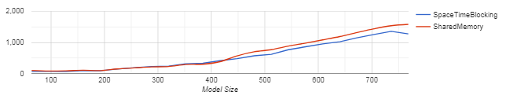

## [22/02] ~ [22:15] -- [24:30]
- Atualização das vizualizações
- Configuração para os testes de desempenho

## [22/02] ~ [20:00] -- [22:00]
- Tentei simplificar uma parte do código onde acreditava ser o problema e fiz desenhos para visualizar melhor, como resultado dessa abordagem consegui que o algoritmo funcionasse utilizando 2 instantes de tempo, como a universidade não permite o acesso após 22hrs, ao chegar em casa vou atualizar o restante dos instantes de tempo e constatar se está funcionando corretamente.

- O segundo instante de tempo se encontra assim:

## [21/02] ~ [6:30] -- [12:00]
- Fui até o rio de janeiro para comprar dois monitores para minha sala, através da olx, configurei um dos computadores que ganhei do LMDC (uns velhos que seriam descartados) e organizei tudo em minha sala, na parte da tarde trabalhei com will no projeto do bikenit e a noite ja estava bastante cansado para trabalhar nesse projeto.

## [20/02] ~ [20:00] -- [23:26]
- Conferência da logica desde o inicicio do programa levando em consideração que os erros podem estar no local onde achamos que mais temos certeza que esta certo
- Depois de alguns testes percebi que o erro só poderia estar no envio dos indices para o calculo do stencil
- constatei um erro, uma confusão entre a variável do tamanho do tile do tempo atual e do tamanho inicial do tile está assim agora, mudou um pouco mas ainda tem alguma coisa estranha.
- Atualização das imagens.

## [19/02] ~ [24:00] -- [25:00]
- Atualização das vizualizações

## [18/02] ~ [20:00] -- [23:25]
- Conferência das variáveis de entrada.
- Retirada de um parâmetro que não esta mais sendo utilizado pelo motivo que não é necessário variar a ordem do stencil até porque a nova logica não perimite isso sendo a ordem sempre 2, mesma coisa com os coeficientes.
- Alguns comentarios adicionados.
- Descobri um valor errado no calculo do tamanho da borda na hora de enviar o indice para a função do calculo do stencil testei apenas com 2 instantes de tempo por vez está assim agora.

## [17/02] ~ [19:30] -- [22:00]
- Alguns erros estão ocorrendo nas copias entre os blocos, estou tentando resolver esse problema, quando percebi que não estava tendo muitas ideias pra tentar resolver o problema, me voltei a corrigir os erros na escrita do artigo. Com dois instantes de tempo o resultado se encontra assim:

## Vizualização da propagação variando o tamanho do domínio

### blocking_352x352_19000steps_15times
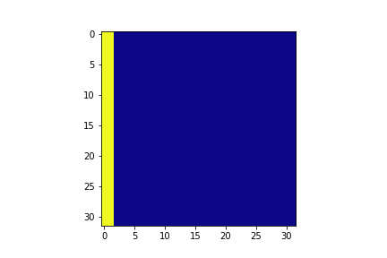

### blocking_64x64_19000steps_15times
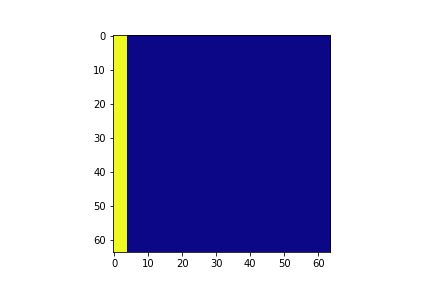

### blocking_96x96_19000steps_15times
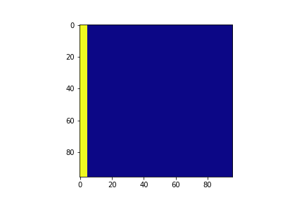

### blocking_128x128_19000steps_15times
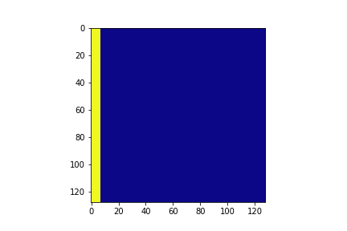

### blocking_160x160_19000steps_15times
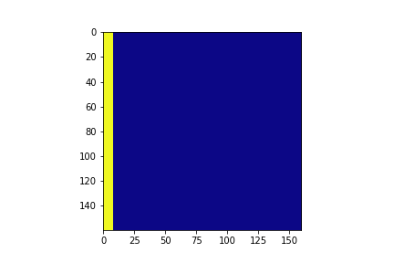

### blocking_192x192_19000steps_15times
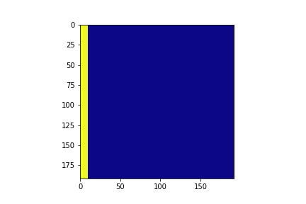

### blocking_224x224_19000steps_15times
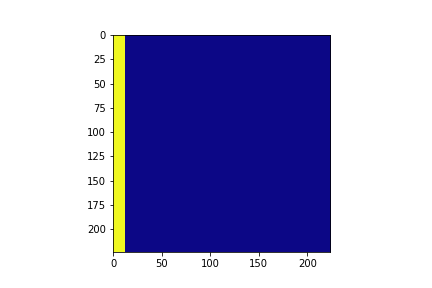

### blocking_256x256_19000steps_15times

### blocking_288x288_19000steps_15times
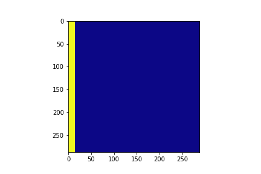

### blocking_320x320_19000steps_15times

### blocking_352x352_19000steps_15times
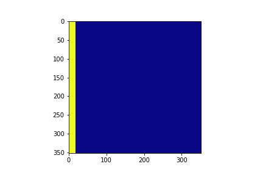

### blocking_384x384_19000steps_15times
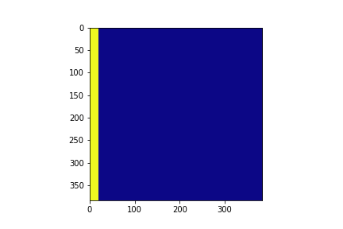

### blocking_416x416_19000steps_15times
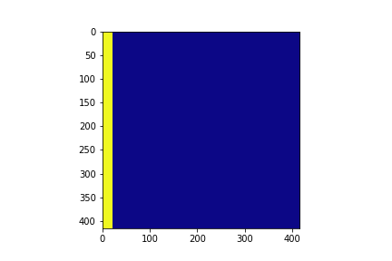

### blocking_448x448_19000steps_15times
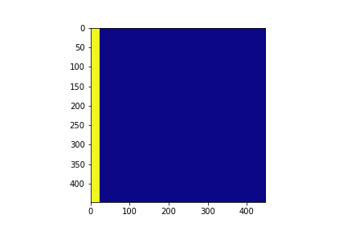

### blocking_480x480_19000steps_15times
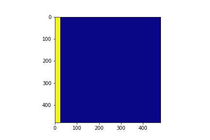

### blocking_512x512_19000steps_15times
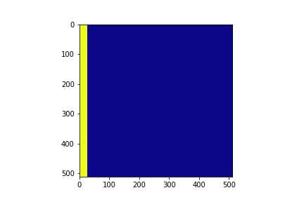

### blocking_544x544_19000steps_15times
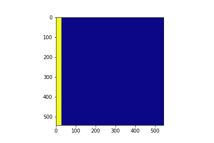

### blocking_576x576_19000steps_15times
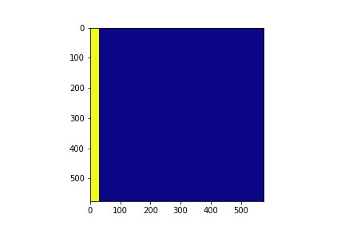

### blocking_608x608_19000steps_15times
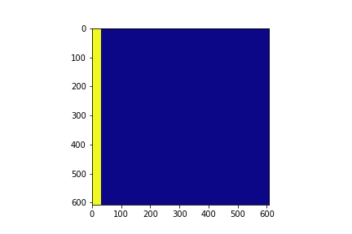

### blocking_640x640_19000steps_15times
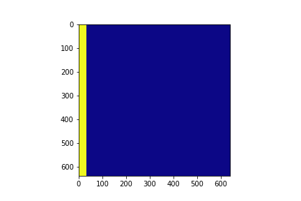

### blocking_672x672_19000steps_15times
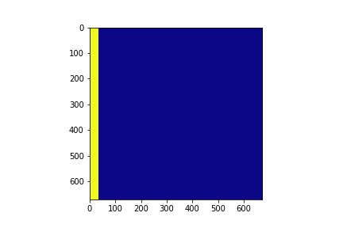

### blocking_704x704_19000steps_15times
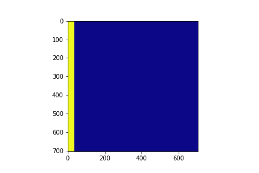

### blocking_736x736_19000steps_15times
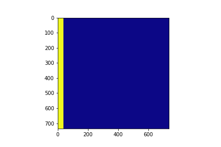

### blocking_768x768_19000steps_15times
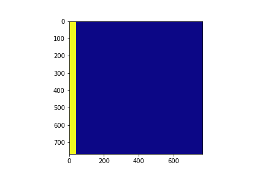