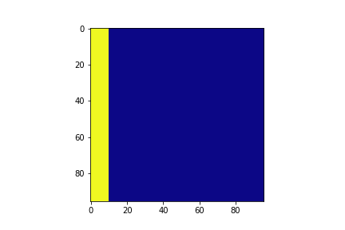
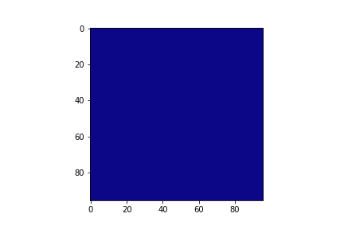

# Estado atual do trabalho
[Link para o PDF do artigo](readmeContent/ICCSA_2020.pdf)

[Link para o notebook do colab](readmeContent/colabNotebook.ipynb)

## [22/02] ~ [22:15] -- [24:30]
- Atualização das vizualizações
- Configuração para os testes de desempenho

## [22/02] ~ [20:00] -- [22:00]
- Tentei simplificar uma parte do código onde acreditava ser o problema e fiz desenhos para visualizar melhor, como resultado dessa abordagem consegui que o algoritmo funcionasse utilizando 2 instantes de tempo, como a universidade não permite o acesso após 22hrs, ao chegar em casa vou atualizar o restante dos instantes de tempo e constatar se está funcionando corretamente.

- O segundo instante de tempo se encontra assim:

## [21/02] ~ [6:30] -- [12:00]
- Fui até o rio de janeiro para comprar dois monitores para minha sala, através da olx, configurei um dos computadores que ganhei do LMDC (uns velhos que seriam descartados) e organizei tudo em minha sala, na parte da tarde trabalhei com will no projeto do bikenit e a noite ja estava bastante cansado para trabalhar nesse projeto.

## [20/02] ~ [20:00] -- [23:26]
- Conferência da logica desde o inicicio do programa levando em consideração que os erros podem estar no local onde achamos que mais temos certeza que esta certo
- Depois de alguns testes percebi que o erro só poderia estar no envio dos indices para o calculo do stencil
- constatei um erro, uma confusão entre a variável do tamanho do tile do tempo atual e do tamanho inicial do tile está assim agora, mudou um pouco mas ainda tem alguma coisa estranha.
- Atualização das imagens.

## [19/02] ~ [24:00] -- [25:00]
- Atualização das vizualizações

## [18/02] ~ [20:00] -- [23:25]
- Conferência das variáveis de entrada.
- Retirada de um parâmetro que não esta mais sendo utilizado pelo motivo que não é necessário variar a ordem do stencil até porque a nova logica não perimite isso sendo a ordem sempre 2, mesma coisa com os coeficientes.
- Alguns comentarios adicionados.
- Descobri um valor errado no calculo do tamanho da borda na hora de enviar o indice para a função do calculo do stencil testei apenas com 2 instantes de tempo por vez está assim agora.

## [17/02] ~ [19:30] -- [22:00]
- Alguns erros estão ocorrendo nas copias entre os blocos, estou tentando resolver esse problema, quando percebi que não estava tendo muitas ideias pra tentar resolver o problema, me voltei a corrigir os erros na escrita do artigo. Com dois instantes de tempo o resultado se encontra assim:

## Vizualização da propagação

### global_96x96_12000steps

### blocking_96x96_12000steps_1times

### blocking_96x96_12000steps_2times

### blocking_96x96_12000steps_3times

### blocking_96x96_12000steps_4times

### blocking_96x96_12000steps_5times

### blocking_96x96_12000steps_6times

### blocking_96x96_12000steps_7times

### blocking_96x96_12000steps_8times

### blocking_96x96_12000steps_9times

### blocking_96x96_12000steps_10times

### blocking_96x96_12000steps_11times

### blocking_96x96_12000steps_12times

### blocking_96x96_12000steps_13times

### blocking_96x96_12000steps_14times

### blocking_96x96_12000steps_15times

### blocking_96x96_12000steps_16times

### blocking_96x96_12000steps_17times

### blocking_96x96_12000steps_18times

### blocking_96x96_12000steps_19times

### blocking_96x96_12000steps_20times
